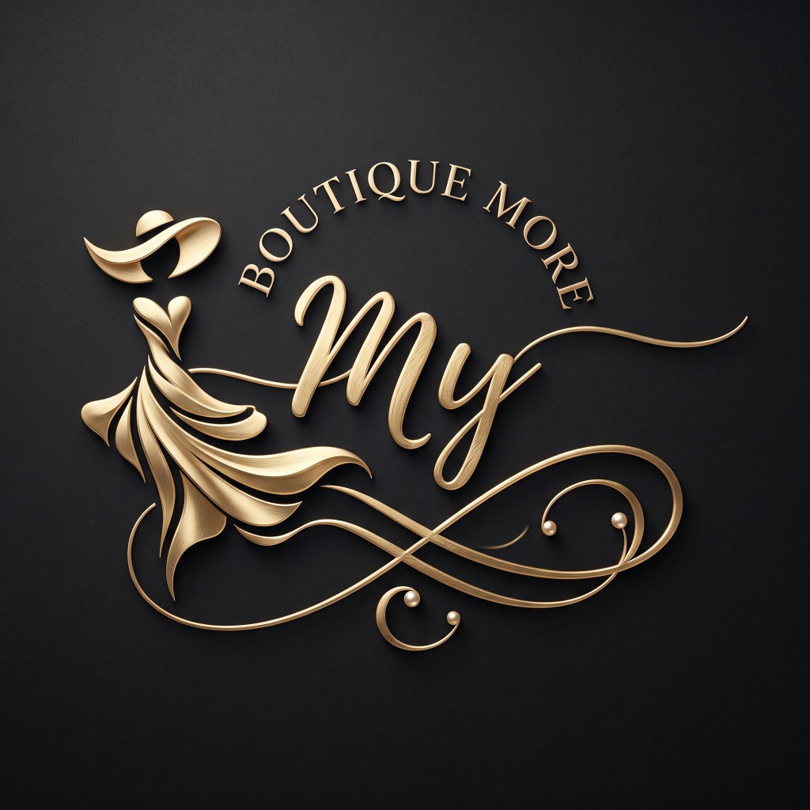

<div align="center">
  
  <h1>👗 MY BOUTIQUE MORE</h1>
  <p><em>“Atemporal • Elegante • Accesible”</em></p>
</div>

Plataforma e-commerce completa y responsive de alta gama para la marca femenina mexicana **My Boutique More**. Diseñada con estética editorial de revista de moda, tonos cálidos, tipografía refinada y experiencia de compra optimizada tanto para dispositivos móviles como escritorio.

---

## 🌟 Identidad & Estética Visual

- **Paleta de Colores Curada**:
  - `Cream / Ivory`: `#F7F2EA`
  - `Warm White`: `#FFFFFF`
  - `Charcoal`: `#292725`
  - `Soft Gold`: `#B99663`
  - `Beige`: `#DCCFBD`
  - `Taupe`: `#A99B8B`
- **Tipografías**:
  - Headings Editoriales: *Playfair Display / Cormorant Garamond*
  - UI & Textos: *Montserrat / Inter*
- **Aesthetic**:
  - Mucho espacio en blanco y fondos cálidos marfil.
  - Microinteracciones fluidas: zoom suave en hover, cambio de segunda imagen de prenda, barra de progreso para envío gratis, transiciones naturales.

---

## 🛍 Módulos y Funcionalidades Desarrolladas

1. **Header Sticky & Mega Menú**:
   - Barra de anuncio superior: *Envío gratis en compras mayores a $1,499 MXN | 3 y 6 MSI*.
   - Mega menú desplegable en **ROPA** (Categorías y sección *Por Ocasión*).
   - Acceso rápido a buscador inteligente en tiempo real, contador interactivo de favoritos (Wishlist) y Drawer del Carrito.
2. **Página de Inicio (Home)**:
   - **Hero Editorial de Campaña**: Fotografía cálida y titulares duales con CTAs.
   - **Descubre Tu Estilo**: 5 cards grandes con fotografía y zoom (*Vestidos, Blusas, Pantalones, Sets, Accesorios*).
   - **Nueva Colección**: Grid responsive de 4 columnas con insignias (*NUEVO, BEST SELLER, ÚLTIMAS PIEZAS, SALE*) y selector express de tallas.
   - **Sección Editorial 50/50**: *“Menos tendencia. Más estilo.”*
   - **Los Favoritos de Laura**: Carrusel horizontal con 4.9 estrellas de reseñas verificadas.
   - **Arma Tu Look**: Desglose de estilismo completo (*Vestido Aura + Bolsa Siena + Aretes Alma = $1,697 MXN*) con botón de compra de conjunto.
   - **Banner Promocional**: Envío gratis a todo México.
   - **Beneficios**: 4 pilares de confianza (Envíos a todo México, Pago 100% Seguro, Cambios Fáciles en 30 días, Compra con Confianza).
   - **Testimonios Reales**: Reseñas verificadas de clientas.
   - **Instagram Grid**: Feed editorial de 6 fotos de `@LAURABOUTIQUE`.
   - **Newsletter**: Formulario con código promocional de bienvenida (*BIENVENIDA15*).
3. **Catálogo & Filtrado Dinámico (`/shop`)**:
   - Barra lateral desktop y drawer mobile.
   - Filtros por categoría, tallas (XS a XL), colores con swatches visuales, rangos de precio en MXN y ordenamiento en tiempo real.
4. **Ficha de Detalle de Producto (`/product/[slug]`)**:
   - Galería de alta resolución con carrusel de miniaturas.
   - Selector interactivo de color y tallas.
   - **Modal de Guía de Tallas** con medidas exactas en centímetros y consejos de medición.
   - Botón directo de compra exprés y agregar a favoritos.
   - Acordeones interactivos: *Descripción & Modelo, Composición & Materiales, Cuidados de la Prenda, Envíos y Cambios*.
   - Slider de prendas recomendadas.
5. **Drawer de Carrito & Vista de Carrito (`/cart`)**:
   - Barra de progreso dinámica para envío gratis (*"Te faltan $XXX para obtener Envío Gratis"*).
   - Modificación de cantidades y variantes.
   - Aplicador de cupones de descuento interactivo (`LAURA10`, `BIENVENIDA15`, `ENVIOGRATIS`).
6. **Checkout Minimalista Seguro (`/checkout`)**:
   - Formulario de dos columnas adaptado para México (selector de estados mexicanos, código postal).
   - Métodos de envío y opciones de pago: Tarjeta de Crédito/Débito, Mercado Pago, PayPal y OXXO Pay.
   - Pantalla de confirmación con número de orden, guía de paquetería y confetti interactivo (`/checkout/success`).
7. **Área de Usuario & Wishlist (`/account` y `/wishlist`)**:
   - Historial de pedidos con estatus de tracking (*En camino, En preparación, Entregado*).
   - Gestión de direcciones y datos personales.
   - Vista dedicada de favoritos.
8. **Dashboard Administrativo (`/admin`)**:
   - Métricas clave: *Ventas del día, Ventas del mes, Total pedidos, Ticket promedio*.
   - Módulos para gestión de productos (agregar nueva prenda, editar precios), pedidos en tiempo real, inventario/stock, cupones activos y reseñas.
9. **Páginas Institucionales**:
   - Preguntas Frecuentes (`/faq`)
   - Contacto & Asesoría (`/contacto`)
   - Nuestra Historia (`/nosotros`)
   - Políticas de Envíos, Cambios y Privacidad (`/politicas`)
10. **Mobile-First & WhatsApp**:
    - Barra fija de navegación inferior para dispositivos móviles.
    - Botón flotante de WhatsApp en todas las páginas con mensaje predeterminado para asesoría de prendas.

---

## 🛠 Stack Tecnológico

- **Framework**: [Next.js 15+ (App Router)](https://nextjs.org/)
- **Lenguaje**: [TypeScript](https://www.typescriptlang.org/)
- **Estilos**: [Tailwind CSS v4](https://tailwindcss.com/)
- **Gestión de Estado**: [Zustand](https://zustand-demo.pmnd.rs/) con persistencia `localStorage`
- **Iconografía**: [Lucide React](https://lucide.dev/)
- **Efectos**: [canvas-confetti](https://www.npmjs.com/package/canvas-confetti)
- **Tipografías**: Google Fonts (*Playfair Display*, *Montserrat*)

---

## 🚀 Instalación y Ejecución Local

```bash
# 1. Clonar el repositorio
git clone https://github.com/Arcano3Ai/LauraBoutique.git

# 2. Instalar dependencias
npm install

# 3. Iniciar servidor de desarrollo
npm run dev

# 4. Compilar para producción
npm run build
npm start
```

Abre [http://localhost:3000](http://localhost:3000) en tu navegador para ver la tienda.

---

© 2026 **Laura Boutique**. Todos los derechos reservados.
